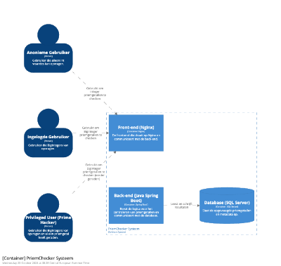

# Documentatie

In de folder `ADR` staan alle Architecture Decision Records.

De belangrijkste toelichting staat in de README.md. Maar hier een verdere uitwerking met [C4model](c4model.com):

> "The C4 model is named after the core set of static structure diagrams: (system) *Context*, *Containers*, *Components* and *Code*." - ([Brown, z.d.](https://c4model.com/diagrams)
 
De C4 diagram komen uit Brown's Structurizr zie de [root README.md](../README.md) hoe dit te runnen/bekijken.

## Domein: Priemgetallen

## Domein: Priemgetallen en Hun Waarde

Priemgetallen zijn fundamentele bouwstenen van de getaltheorie. Ze zijn getallen die alleen deelbaar zijn door 1 en zichzelf. Hoewel dit op het eerste gezicht misschien wiskundig triviaal lijkt, hebben priemgetallen enorme waarde in de moderne informatica, vooral in cryptografie. In veel cryptografische algoritmen, zoals **RSA** en **Diffie-Hellman**, worden priemgetallen gebruikt om veilige communicatiemethodes te ontwikkelen.

### Diffie-Hellman Key Exchange

Een klassiek voorbeeld van het gebruik van priemgetallen in cryptografie is het **Diffie-Hellman key exchange protocol**. Dit protocol stelt twee partijen in staat om veilig een gedeeld geheim te genereren, zelfs over een onbetrouwbaar netwerk dat door afluisteraars wordt gemonitord. De kracht van dit protocol komt voort uit de moeilijkheid van het berekenen van discrete logaritmen in een priemgetallenveld.

Door deze rekenkundige uitdaging is het voor kwaadwillenden bijna onmogelijk om de geheime sleutel te achterhalen. In plaats daarvan moeten ze proberen een groot getal te factoriseren, wat een bekend complex probleem is.

## Architectuur

De PriemChecker bestaat uit verschillende services die zowel in Java als .NET zijn geïmplementeerd. Communicatie tussen services kan via twee mechanismen plaatsvinden:

1. **RabbitMQ Workqueue**: De Java Iterator Service publiceert een reeks getallen naar een RabbitMQ queue, waar de .NET PriemChecker Service de berichten consumeert en berekent of de getallen priemgetallen zijn.
2. **REST API**: Alternatief kan de Java Iterator Service via een REST API direct de .NET PriemChecker Service aanroepen.

De architectuur is gedocumenteerd met behulp van het **C4-model** (Context, Container, Component en Code) en gevisualiseerd met Structurizr.

## Documentatie

Zie de `docs/` directory voor verdere documentatie over de architectuur, use cases en de onderliggende microservices-communicatiepatronen.

## System architectuur

We gebruiken C4 diagrammen om de Software Architectuur van de PriemChecker weer te geven op verschillende niveaus. Figuur 1 toont het gehele systeem in een C4 System Context diagram.

```plantuml
!define RECTANGLE <<rectangle>>

title PriemChecker - Context Diagram

actor AnoniemeGebruiker as AnonymousUser
actor IngelogdeGebruiker as LoggedInUser
actor PrimeHacker as PrivilegedUser
actor AdminUser as Admin

AnonymousUser --> PriemCheckerApp : "Getal insturen (int)"
LoggedInUser --> PriemCheckerApp : "Getal insturen (BigInteger)"
PrivilegedUser --> PriemCheckerApp : "Eerder opgevraagde getallen, max 1/dag"
Admin --> PriemCheckerApp : "Statistieken opvragen"

boundary PriemCheckerApp {
  RECTANGLE FrontEnd as FE
  RECTANGLE BackEnd as BE
  RECTANGLE SQLServer as DB
  RECTANGLE ExternalSuperComputer as PrimeSuperComputer
}

FE --> BE : "API requests (JSON)"
BE --> DB : "Opslaan en ophalen priemgetallen"
BE --> PrimeSuperComputer : "Uitbesteden zware berekeningen"
```

*Figuur 1*: Het systeem en zijn gebruikers en externe systemen

En Figuur 2 toont het met Structurizr gemaakte Context diagram, waarin de gebruikers ook zichtbaar zijn. Het Container en Component diagram tonen ook meer internals, inclusief technische internals. De opdeling klopt grof weg, maar hier is nog iets mis mee, wat de lezer mag bekijken. Dus domweg copy-pasten kan natuurlijk sowieso niet. Daarom gebruiken we hier opzettelijk de 'low res' thumbnail preview. Run Structurizr om de hi-res versies te zien.

Maar dit is al wel prima bruikbaar voorbeeld opzet voor C4 diagrammen voor bijvoorbeeld een [PitStop uitbreiding (HAN Minor DevOps, 2024)](http://minordevops.nl/week-7-8-beroepsproduct/workshop-user-story-mapping.html#casussen-uitbreiding-pitstop).


*Figuur 2*: Het Systeem Context diagram met de 3 gebruikers en beoogde externe koppeling.



*Figuur 3*: Het Container diagram van applicatie: Alleen het is toch .NET i.p.v. Java?


*Figuur 4*: Een component diagram van de back-end container.

## Bronnen

- https://c4model.com/diagrams
- HAN Minor DevOps (z.d.) *Workshop User Story mapping - Casussen Uitbreiding Pitstop* minordevops.nl. Geraadpleegd november 2024 op <http://minordevops.nl/week-7-8-beroepsproduct/workshop-user-story-mapping.html#casussen-uitbreiding-pitstop>
